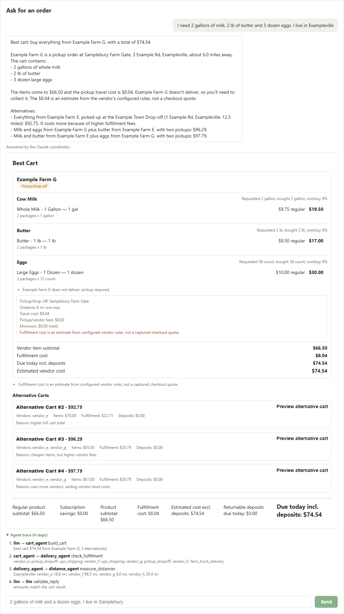

# FarmFind

I made FarmFind for my own use, because comparing farm web shops by hand takes a long time. Every shop has its own package sizes, shipping fees and order minimums, so the cheapest product usually isn't the cheapest order. FarmFind reads the products from the shops, converts them to the same units and finds the cheapest cart for a shopping list. You can also type the order into a chat.

Everything in this repository is sample data. The vendors, towns and prices are fictional.



## Finding the cheapest cart

Every listing is converted to one unit per product (milk in gallons, butter in pounds, eggs by count), so prices can be compared directly. The cart search then finds the cheapest cart for the list after shipping, fees, order minimums and pickup options, and shows a few alternatives.

The search tries every combination, so it suits short lists and a handful of vendors.

## Reading the shops

Shop pages are read with a browser (Playwright), including shops that show prices only after login. What it finds waits in a review list, and only approved products reach the catalog.

The fetcher has offline tests only. In this repository it isn't run against live shops, and its page parsers are written for specific shop layouts.

## The chat

You can type an order as a sentence, for example "I need 2 gallons of milk, 2 lb of butter and 3 dozen eggs, I live in Exampleville". Four small agents (catalog, distance, delivery, cart) do the work, and a coordinator decides which ones to call. The default coordinator is plain rules and needs no key. The other one lets a Claude model choose the agents and word the answer.

Prices never come from the model. Every dollar amount in a model-written reply has to appear in the cart result, or the reply is rejected. If the model call fails, the rule-based coordinator answers instead. If you read one function in this repository, read `reply_problems` in `backend/app/agents/replies.py`, which is that check.

I ran the Claude coordinator live by hand on 2026-10-01, six turns through the Claude Code sign-in. The answers are in [docs/live-run.md](docs/live-run.md). The API-key path hasn't been run live, and no automated test calls a real model.

## Run it

The backend is Python and FastAPI, with the unit conversion, the cart search, the page fetcher and the chat. From `backend/`:

```bash
python -m venv .venv && source .venv/bin/activate    # Windows: .venv\Scripts\activate
pip install -r requirements.txt
playwright install chromium                          # only needed for fetching shop pages
uvicorn app.main:app --reload                        # http://localhost:8000
```

The dashboard is React and TypeScript, built with Vite. From `frontend/`:

```bash
npm install
npm run dev                                          # http://localhost:5173
```

In the dashboard, pick "Demo samples only" as the catalog to see the sample vendors. Chat works without a key. How to turn on the Claude coordinator is in [docs/architecture.md](docs/architecture.md#chat-agents).

The tests:

```bash
cd backend && pytest             # 431 tests, all offline
cd frontend && npm run build     # type-checks and builds
```

[docs/architecture.md](docs/architecture.md) has more on how it's put together, and ends with the rest of what's unfinished.
