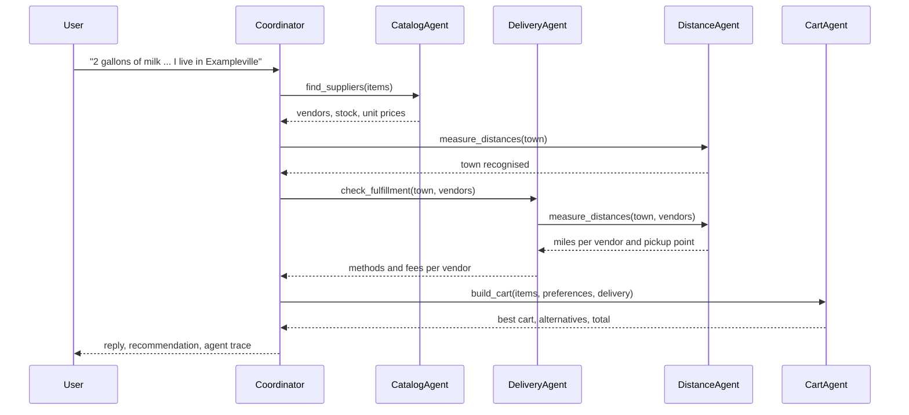

# How FarmFind works

FarmFind has two jobs: get product data out of farm web shops into a catalog I can review, and pick the cheapest cart from that catalog. The two halves share only the JSON catalog files. A chat layer sits on top of the cart half.

## Catalog and units

`data_loader.py` builds the catalog in one of three modes:

- `demo_only`: the sample vendors and products in `vendors.json` and `products.json`.
- `imported_only` (the API default): products approved in import review, kept in `staged_products.json`.
- `imported_plus_demo`: both.

`staged_products.json` is local data and not in the repository, so a fresh copy needs the demo catalog to show anything.

Each product type (`cow_milk`, `sheep_milk`, `cream`, `butter`, `cheese`, `eggs`) has one unit: gallon, gallon, pint, lb, lb and count. `normalizer.py` converts package sizes to it (a quart of milk is 0.25 gallon, a dozen eggs is 12), so listings compare as price per unit. Listings that cannot be converted or are out of stock are left out and reported.

## Fetching shop pages

Everything in `backend/app/fetcher/` is ordinary code. No model decides what to fetch or how to read a page.

- `vendor_pages.json` lists the pages to fetch per vendor. `vendor_accounts.json` holds each shop's login URL, form selectors and the markers that show a login worked or a CAPTCHA appeared.
- `credentials.py` saves a vendor's username and password in the OS keyring. Only a masked username and a status are written to JSON, and the API never returns secrets.
- `account_connections.py` opens Chrome with its own saved profile per vendor (`backend/.browser_profiles/`, git-ignored) and logs in. If a CAPTCHA or a 2FA prompt shows up, it waits for a person to finish it.
- `vendor_fetcher.py` loads each page and saves the HTML, the text, screenshots and a summary under `backend/data/fetches/` (git-ignored). `detection.py` labels each result (`success`, `login_required`, `captcha_required`, `pricing_locked` and so on). Pages fetched recently are skipped unless forced.
- `grazecart.py`, `variant_capture.py` and `package_parser.py` read listings, variant dropdowns, package sizes and prices out of the saved pages.

It never places an order and never tries to get around a CAPTCHA. The commands, run from `backend/`:

```bash
python -m app.fetcher.credentials set --vendor-id vendor_a --username <user>   # asks for the password
python -m app.fetcher.login_vendor --vendor-id vendor_a
python -m app.fetcher.fetch_vendor_pages --vendor-id vendor_a                  # add --force to refetch
python -m app.fetcher.create_import_candidates --vendor-id vendor_a --page-id cow_milk --latest
```

The other small scripts in that folder are one-step helpers for logging in and capturing pages by hand.

## Import review

`import_candidates.py` turns what was captured into candidates, each with its package size, unit, price, stock and a flag for anything uncertain. In the dashboard a candidate can be approved, rejected or edited. Approving one writes a product to `staged_products.json`. Candidates that match a short "plain products only" keyword list (frozen, flavored, cultured and similar) are excluded by default.

## Cart search

`optimize()` in `optimizer.py` depends only on its inputs: the request, the products and the vendors.

1. Each requested quantity is converted to the product's unit.
2. For each item, `combinations.py` tries the package counts at each vendor and keeps the cheapest set that covers the request without going over the overbuy limit.
3. Every cart made of one option per item is priced by `fulfillment.py`: products, deposits, then pickup, UPS shipping or farm-truck delivery per vendor. Fees are charged once per vendor, and the cheapest method that all of that vendor's items support is used.
4. A method that misses its order minimum is rejected when minimums are enforced. The shortfall is reported either way.
5. Limits from the request (maximum number of vendors, required vendors, no pickup-only carts) filter the carts. If no cart meets a limit, the limit is dropped and a warning is returned. A packaging or storage preference such as glass or fresh wins only if its cart costs at most 10 percent more than the cheapest.
6. Carts are sorted by total cost. The first is the answer and up to three more come back as alternatives, each with the reason it lost.

The search tries every combination, so it suits short lists and small catalogs.

## Chat agents

`backend/app/agents/` adds no pricing of its own. The agents call the modules above.

- `messages.py`: the typed input and output of every agent.
- `bus.py`, `audit_log.py`: the message bus. It checks each message against the receiving agent's input type, runs the agent and logs the exchange. One turn's log is the agent trace.
- `catalog_agent.py`, `distance_agent.py`, `delivery_agent.py`, `cart_agent.py`: the four agents. `geo.py` looks towns up in `data/locations.json` and measures straight-line distance.
- `request_parser.py`, `coordinator.py`: the rule-based coordinator and the pattern matching it uses to read a message.
- `llm_coordinator.py`: the Claude coordinator, a tool-use loop of at most eight model calls per turn. This file reaches the model with an API key.
- `claude_code_coordinator.py`: the same coordinator reaching the model through the Claude Code sign-in. The Claude Agent SDK runs the loop and gets the four agents as in-process tools. Claude Code's own tools (files, shell, web) are switched off. Tool calls, reply check and fallbacks are shared with the file above.
- `replies.py`: the template answer and the check applied to a model-written reply.
- `chat.py`: keeps conversations in memory and picks the coordinator: the Claude one with `FARMFIND_COORDINATOR=claude_code` or with `ANTHROPIC_API_KEY` set, if the matching package is installed, otherwise the rule-based one.

The rule-based coordinator calls the agents in this order. The Claude coordinator may choose a different one.



What the model can do is kept narrow. Its tool input is checked by the bus, and a bad call goes back to it as an error. Its `build_cart` tool does not accept delivery data, so it cannot hand the cart search its own fees or distances.

Every price and total comes from ordinary code in the agents, never from the model. Before a model-written reply goes out, each dollar amount in it has to appear in the `CartAgent` result and the cart total has to be stated. A reply that quotes any other amount is rejected: the model gets one chance to correct it, and after that a fixed template writes the answer. If the model call fails, the model refuses or it uses up its eight steps, the rule-based coordinator takes over the turn. When the items or the town are missing, either coordinator asks one question and waits for the answer.

To turn on the Claude coordinator, run `pip install -r requirements-agents.txt` and set one of two things before starting the backend. `FARMFIND_COORDINATOR=claude_code` uses the Claude Code sign-in on this computer, so Claude Code has to be installed and signed in, and no API key is needed. `ANTHROPIC_API_KEY` uses the Claude API instead. `FARMFIND_MODEL` picks the model (default `claude-sonnet-5-5`). Each response says which coordinator answered. In the tests the Claude coordinator talks to stand-ins: a scripted API client and a fake Agent SDK.

The chat can also be called directly. Send the returned `conversation_id` with the next message to continue a conversation:

```bash
curl -X POST http://localhost:8000/chat -H "Content-Type: application/json" \
  -d '{"message": "I need 2 gallons of milk, 2 lb of butter and 3 dozen eggs, I live in Exampleville"}'
```

## API

- `GET /health`, `GET /vendors`, `GET /products`: status and the catalog for a `catalog_mode`.
- `POST /optimize`: the cheapest cart plus alternatives.
- `POST /chat`: one chat turn with the reply, the recommended cart, a follow-up question if one is needed, and the agent trace.
- `/vendor-connections/...`: login status, opening a login browser, starting a fetch and following its progress, reading a shipping quote from a cart page.
- `/fetches`, `/import-candidates/...`: what was fetched, and listing, approving, rejecting and editing candidates.

## Frontend

`frontend/src/api.ts` is a small fetch client. Its base URL comes from `VITE_API_URL` (default `http://localhost:8000`). `App.tsx` holds the order settings and shows the chat panel, the order form, the best cart, import review and vendor connections. The chat panel reuses the best-cart component for a recommendation and puts the agent trace in a fold-out under each answer.

## Smaller limitations

The main ones are in the README. The rest:

- The rule-based coordinator understands simple phrasings (quantity, unit, product, "I live in ..."), not free-form language.
- Chat conversations are kept in memory and lost on restart. Storage is JSON files, not a database.
- The chat panel is checked by hand. The README example, sent from the dashboard, came back with a cart from the rule-based coordinator and from the Claude coordinator (the screenshot in the README).
- The reply check is strict. A real amount that comes from another agent, such as a unit price or an order minimum, is rejected too, because only amounts in the cart result pass. It also cannot tell whether an amount is attached to the right item.
- Chat distances come from five invented towns with made-up coordinates. The sample towns are Exampleville, Samplebury, Demoton, Mockford and Testerfield.
- With the Claude Code sign-in every chat turn starts a Claude Code process, so a turn took 6 to 19 seconds in the live run. Earlier turns are passed to the model as plain text, without the earlier agent results.
- When no cart fits, the cart agent's summary lists every item as unavailable, even if only one item is the cause.
